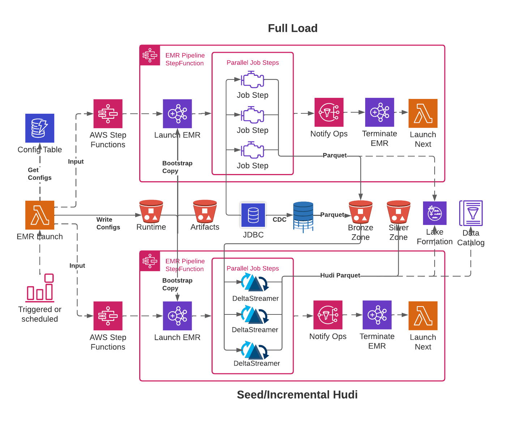

# AWS Data Analytics Black Belt Capstone project

## Batch/incremental ingestion from RDBMS into Modern data lake architecture    

### Summary    

This project is a modern approach to keeping a data lake up to date from an operational source.   
The source for this project is an Amazon RDS Postgres instance using HammerDB to generate production-like load. 

### Project Highlights

Technology choices include:

- AWS Step Functions
- DMS (for CDC data)
- Amazon EMR with Apache Hudi
- S3
- AWS Glue Data Catalog
- LakeFormation
- Amazon Athena
- Amazon QuickSight
- DynamoDB (for pipeline configuration data)

#### Data Collection 

Data collection leverages:
- Amazon EMR
- Step Functions
- AWS DMS (CDC)
- AWS LakeFormation

The data ingestion and processing is done by an Amazon EMR (JDBC load) and AWS DMS(CDC).    
Using Amazon EMR for the full load allows for ultra scalability and customization.    
The initial use case is Spark over JDBC but the ingestion pipeline could easily add unstructured data sources. 

#### Data Storage

Data storage and management leverages:
- LakeFormation and Glue Data Catalog
- S3 (Data Lake)
  - Versioning
  - Lifecycle policies 
    - remove old versions
    - remove CDC files after retention period
  - Bronze (landing, raw) and Silver zones
  - Compression
  - Parquet and Hudi
  - Bucket Policies enforcing VPC Endpoints

Amazon S3 is the data storage layer. For management, Amazon EMR is configured to use LakeFormation and Glue Data Catalog.
For DR procedures, please see the [DR Plan](docs/DR.md)

#### Data Processing   
##### Highlights
- Amazon EMR is leveraged and tested to process data at scale
  - DynamoDB Config integration allows full performance tuning of EMR clusters and spark job steps
    - Future state, would create an API/UI for updating pipeline configs in DynamoDB. For now, there is a [helper script](helpers/import_config_data.py).
  - Successful testing of a ~200 million row order-line table took less than 30 minutes (8x r5.2xlarge worker nodes)
  - The system is built off several pipeline types, `system` and `custom`. 
    - The `system` pipelines offer a consistent way to ingest and load tables into the Bronze and Silver zones (as Hudi Tables)
    - `Custom` pipelines allow running any sort of use-case specific code, such as denormalizing or pre-aggregating tables

##### System Pipelines
- Lightweight transformations are applied to make the datasets Hudi and CDC merge compatible
- Larger tables are partitioned for more efficient access
- For Hudi table updates, the pipeline can run in Incremental (scheduled hourly) or Continuous (persistent EMR cluster) depending on requirements.
- Analytical job code and libraries are deployed and stored in an artifact CICD s3 bucket
  - TODO: CI/CD automated build/deploy on github commit/merge

##### Custom pipelines
- Can be anything Amazon EMR based, just bring your own script and configure the pipeline in DynamoDB.
- Can be configured to run automatically after a previous pipeline

#### System Pipeline Diagram    

   

#### Data Analysis and Visualization
For Consumption:
- Amazon Athena Data source is configured in Quicksight
- Quick sight is using live connection against Hudi tables

#### Data Security    
For security:
- All credentials are stored in AWS Secrets Manager
- VPC Endpoints have been configured for all services that support them
- Separate IAM roles for the different components
- Public access is blocked on all S3 buckets
- All data infrastructure sits in private subnets
- Bucket policies in place to prevent S3 requests that don't originate from a VPC Endpoint
- SSE-S3 used for S3 object encryption at rest
- Amazon EMR and DMS instance volumes are KMS encrypted at rest
- LakeFormation is used as an additional security layer and is used by Amazon EMR and Athena/Quicksight   

### Project structure

This project uses AWS SAM for AWS resource deployment and a Makefile to build/deploy EMR related code and libs.   
[template.yaml](template.yaml) is the parent stack.  
This is the only stack you will name, everything else will be generated based on this and child stack names.   
Child stacks can be found under the [templates](templates/) directory.    
Please find [cloudformation.png](images/cloudformation.png) for a diagram of stack contents.

## Deployment

### Prerequisites   

The following prerequisites and information are needed before deploying this solution

#### Local Environment configurations
  - AWS CLI
    - Admin Credentials configured (Fine-grained permissions required to deploy this have not been established)
  - AWS SAM CLI
  - Python 3.9

#### AWS Account
  - [LakeFormation Admin permissions configured](https://catalog.us-east-1.prod.workshops.aws/v2/workshops/78572df7-d2ee-4f78-b698-7cafdb55135d/en-US/lakeformation-basics/datalake-administrator)
  - An Existing Postgres RDS Database
    - Obtain the connection information
      - Including Usernames for AWS DMS and Spark
      - The users must have proper permissions configured
    - Obtain a list of schemas and tables
      - For larger tables, obtain integer boundary and partitioning information to configure Spark JDBC for better performance
    - This database instance should be [configured for replication](https://docs.aws.amazon.com/dms/latest/userguide/CHAP_Source.PostgreSQL.html)
  - Networking Configuration
    - Networking can be configured in one of two ways:
      - Bring your own
      - Stack creates everything (VPC, public/private subnets, VPC Endpoints, etc)
  - Determine the region you would like to install
  - Determine if you would like to create the AWS DMS infrastructure
  - Determine if you would like to create the consumption layer (Quicksight, Athena workgroup)
  - Determine if the [DMS VPC](https://console.aws.amazon.com/iam/home#/roles/dms-vpc-role) service role already exists in your account
      - If not, this solution will create it 
  - An email address for operational/runtime notifications
    - Job state information will be sent to the operator email address

### Cloudformation Deployment Parameters

After gathering deployment prerequisites/requirements, decide the following Cloudformation parameters

|Parameter|Default?|Description|
|---------|-------|-----------|
|UseCase| |The use case. This will be used for naming resources throughout nested stacks (eg: Glue Database Name)|
|CreateNetworkInfrastructure|TRUE|Whether or not this solution will create the networking infrastructure|
|VpcSubnetIpBlocks|"10.0.0.0/24, 10.0.1.0/24, 10.0.2.0/24, 10.0.3.0/24"|Comma separated list of four Cidr ranges. Used when CreateNetworkInfrastructure is TRUE|
|VpcSubnetIds|""|Comma separated list of two existing private subnets this stack will run in. Ignored if CreateNetworkInfrastructure is set to TRUE|
|OpsEmailAddress| |The Operations team email address for notifications|
|DbEndpoint|xxxxxxxxx|The RDS endpoint. If left as default, the AWS Secret and DMS endpoint will need to be manually updated after deployment.|
|DbName|xxxxxxxxx|The RDS database name. If left as default, the AWS Secret and DMS endpoint will need to be manually updated after deployment.|
|DbEngine|postgres|The database engine. Only postgres is currently supported|
|DbPort|5432|The RDS port|
|DbUserNameSpark|spark|The username for the Amazon EMR spark jdbc connection|
|DbUserNameDms|awsdms|The username for AWS DMS endpoint|
|CreateDmsVpcRole|FALSE|Whether or not to create the DMS VPC Role. Set to TRUE if you have not ever used AWS DMS in this account.|
|CreateDmsInfrastructure|FALSE|Whether or not to create the DMS Infrastructure. If you plan to use a different solution for incremental changes or want to create these resources later, set to FALSE.|
|CreateConsumptionStack|FALSE|Whether or not to create the Quicksight and Athena resources.|
|IncrementalSchedule|rate(2 hours)|The incremental Hudi schedule|

### Installation

#### AWS SAM

Once parameters are decided, AWS SAM can deploy in guided mode (interactive), or you can create a configuration file.   
The default configuration file used is [samconfig.toml](samconfig.toml), this has been populated with some examples.   
Update the config file with the configuration information gathered previously.    

##### Deployment using default.deploy.parameters config section in samconfig.toml
```
sam build
sam deploy
```

If you have named your config section something else, this can be accessed with `--config-env` argument eg: `sam build --config-env my-env`   
Example SAM deployment output can be found [here](docs/sam_output.md).

##### Secrets

Once your stack has been created, two new AWS SecretsManager secrets will exist:

```
<stack name>/rdbms/rds/primary/spark
<stack name>/rdbms/rds/primary/dms
```

Navigate to these secrets, and set the appropriate passwords for each account.   
TODO: Automatically generate the password as part of the stack, and configure automatic password rotation

##### DMS Infrastructure

If you created the DMS Infrastructure before updating the SecretsManager password, navigate to the DMS Endpoint and update the password there as well.

#### Makefile

Once the cloudformation stacks have been created, upload EMR related code and libs to the cicd artifact bucket

`make STACK_NAME=hudi-lake REGION=us-east-1 build deploy`

#### DynamoDB configuration

DynamoDB stores configuration information for the EMR Pipeline/StepFunction. DynamoDB records need to be added specifically for your database/UseCase.   
Please review the [DynamoDB Runtime config table documentation](docs/dynamodb.md).   
You can add records to DynamoDB manually (not recommended), or you can [modify the sample file provided](helpers/runtime-configs.json) and then import it with:   

```
python -m pip install boto3
cd helpers
python ./import_config_data.py --table-name <your dynamodb table name>
```

#### Deploy your AWS DMS replication task stack    

The AWS DMS replication task is created separately from the previous infrastructure.    
These tasks vary based on the environment, source database, etc.    

- *Update [templates/dms-replication-task.yaml](templates/dms-replication-task.yaml) for your use case*
- Deploy the stack 
  ```
  aws cloudformation create-stack --stack-name hudi-lake-cdc \
  --template-body file://templates/dms-replication-task.yaml \
  --parameters \
  ParameterKey=UseCase,ParameterValue=rdbms_analytics \
  ParameterKey=ParentStack,ParameterValue=hudi-lake \
  ParameterKey=ReplicationInstanceClass,ParameterValue=dms.c4.xlarge
  ```
  - `UseCase` should match what was previously chosen
  - `ParentStack` should match the base stack name created previously with `sam deploy`
  - `ReplicationInstanceClass` should be sized according to the use case    

## Operating the system

Once the above installation and configuration is complete, you are ready to start processing data        

#### Enable the system and load the data lake

- Start the CDC replication task created previously, this must be done before the next step or there will be missing data
- Enabled the full load
  - `make STACK_NAME=hudi-lake REGION=us-east-1 enable_jdbc`
  - This will enable the full load EventBridge schedule, which runs every 7 days (from the time you enabled it)
  - The reason this runs every 7 days is to make recovery in the event of a failure faster
- Assuming you have next_pipeline configured in your `pipeline::system::jdbc_load` dynamodb config entries EG:
  - ```
      "next_pipeline": {
        "pipeline_type": "seed_hudi",
        "enabled": true
    }
    ```
  - Once the full load is complete, seed_hudi pipeline should be kicked off
  - Once seed_hudi is complete, incremental_hudi pipeline should be kicked off (assuming again, next_pipeline is configured)
  

#### Incremental updates

Once the Datalake has been created, and the Hudi tables populated, you are ready to apply incremental updates.   
Incremental updates leverage [Hudi's DeltaStreamer in either Run Once or Continuous modes](https://hudi.apache.org/docs/deployment/#deltastreamer)

##### Run Once Mode (scheduled incremental)
If your requirements allow a scheduled incremental update, enable the incremental schedule
- This will apply incremental changes to your hudi tables based on the schedule you defined in stack parameter `IncrementalSchedule`
- `make STACK_NAME=hudi-lake REGION=us-east-1 enable_incremental`   

##### Continuous mode (Experimental) (long-running EMR cluster)
If you would like to apply incremental updates continuously, pipeline::config::incremental_hudi.next_pipeline should be cofigured
```
"next_pipeline": {
  "pipeline_type": "continuous_hudi",
  "enabled": true
}
```
 - This launches a long-running EMR cluster that will use Hudi DeltaStreamer with --continuous flag
   - *NOTE*: This requires careful tuning of the EMR cluster, each table will sync as a separate EMR job step in parallel
 
## Out of scope

The following components are out of scope of this project

- Networking to the RDS DB instance
  - You can move the DB Instance into a stack-created subnets
  - Or, you can configure connectivity manually and leave the DB instance where it is
- RDS Database configuration

